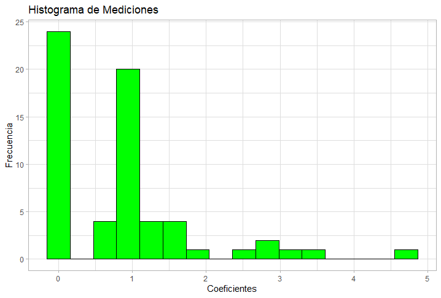

# Postwork Sesión 4.

#### Objetivos

El objetivo de este postwork es investigar la dependencia o independecia de las variables aleatorias X y Y, que corresponden a el número de goles anotados por el equipo de casa y el número de goles anotados por el equipo visitante con los que hemos trabajado en postworks anteriores.

#### Sobre la independencia en probabilidad

La definición de **independencia** en teoría de probabilidad podemos encontrarla enunciada como:

*"Dos eventos son independientes si la probabilidad de que ocurran ambos simultáneamente es igual al producto de las probabilidades de que ocurra cada uno de ellos."*

En otras palabras:

*"Dos eventos son independientes si la probabilidad conjunta es igual al producto de las probabilidades marginales independientes."*

Matemáticamente:

<p align="center">

</p>

Si son iguales, es lógico decir que el cociente de ambos sea igual a 1:

<p align="center">

</p>

De esta forma podemos garantizar la **independencia** de ambas variables.

#### El método bootstrap

#### Desarrollo

En el [Postwork03](/Postwork3/) estimamos las probabilidades conjuntas de que el equipo de casa anote X goles, y el equipo visitante anote Y goles, en un partido. Por lo que el siguiente paso para verificar independencia sería obtener el producto de las probabilidades marginales. Haciendo uso de nuestro archivo csv diseñamos el data frame y cargamos las bibliotecas `ggplot2()` y `dplyr()`:

```R
library(dplyr)
library(ggplot2)
setwd("C:/Users/JMCas/Directorio_Trabajo/DataSets")
data <- read.csv("resultado.csv")

goles <- select(data, FTHG, FTAG)
goles_tabla <- table(goles)

goles_casa <- margin.table(goles_tabla,1)
goles_visita <- margin.table(goles_tabla,2)

prob.casa <- prop.table(goles_casa)
prob.visita <- prop.table(goles_visita)
prob.conjunta <- prop.table(goles_tabla)

prob.casa.df <- as.data.frame(prob.casa)
prob.visita.df <- as.data.frame(prob.visita)
prob.conjunta.df <- as.data.frame(prob.conjunta)
```
Realizar el producto de las probabilidades marginales se simplifica utilizando dos ciclo `for`, uno anidado dentro del otro:

```R
for (i in 1:length(prob.visita.df$Freq)){
  for (j in 1:length(prob.casa.df$Freq)){
    x <- data.frame( "FTHG" = j-1, "FTAG" = i-1, "Freq" = (prob.visita.df$Freq[i])*(prob.casa.df$Freq[j]))
    if (i==1 && j==1 ){
      prob.producto.df <- x
    } else {
      prob.producto.df <- rbind(prob.producto.df,x)
    }
    
  }
}
```
De acuerdo al tamaño de los data frame establecemos la cantidad de iteraciones, en el primer ciclo se establece la estructura del data frame que será similar a los anteriores con los goles jugando en casa `FTHG`, goles como visitante `FTAH` y la probabilidad `Freq`. En el resto de ciclos se iran añadiendo filas al dataframe para las combinaciones de goles restantes. Inspeccionamos ambos data frame:

```R
prob.producto.df
prob.conjunta.df
```

Con ambas probabilidades calculadas, podemos dividir ambas y obtener coeficientes con los cuales verificar la independencia de las variables. Para una mejor observación de los coeficientes y de que combinaciones de los goles de casa (X) y goles de visita (Y) provienen, se diseña un data frame que contenga toda esta información:

```R
coef <- (prob.conjunta.df$Freq)/(prob.producto.df$Freq)
coef.df <- data.frame( "FTHG" = prob.conjunta.df$FTHG , "FTAG" = prob.conjunta.df$FTAG , "Conjun" = prob.conjunta.df$Freq, 
                       "Prod" = prob.producto.df$Freq,"Coef" = coef )
```

Inspeccionando un poco el data frame:

```R
head(coef.df)
tail(coef.df)
```

La consola muestra:

<p align="center">

</p>

Observamos algunos valores de los coeficientes, sin embargo podemos obtener más información analizando estos datos si obtenemos el promedio y la desviación estándar, junto a un histograma que muestre la frecuencia con la que se distribuyen:

```R
mean(coef)
sd(coef)
coef.df %>%
  ggplot() + 
  aes(Coef) +
  geom_histogram(bins = 8, col="black", fill = "green") + 
  ggtitle("Histograma de Mediciones") +
  ylab("Frecuencia") +
  xlab("Coeficientes") + 
  theme_light()
```
Sabemos entonces que los coeficientes tienen una media con valor de 0.8595708 y los valores de los coeficientes se alejan de la media aproximadamente en 0.9801441. y el histograma siguiente nos muestra de una manera más gráfica que la mayoría de los coeficientes tienen valores entre 0 y 2:

<p align="center">

</p>


2. Mediante un procedimiento de boostrap, obtén más cocientes similares a los obtenidos en la tabla del punto anterior. Esto para tener una idea de las distribuciones de la cual vienen los cocientes en la tabla anterior. Menciona en cuáles casos le parece razonable suponer que los cocientes de la tabla en el punto 1, son iguales a 1 (en tal caso tendríamos independencia de las variables aleatorias X y Y).
