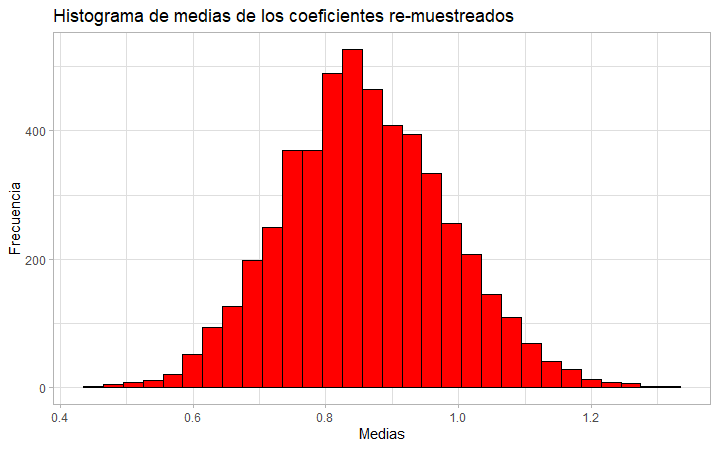
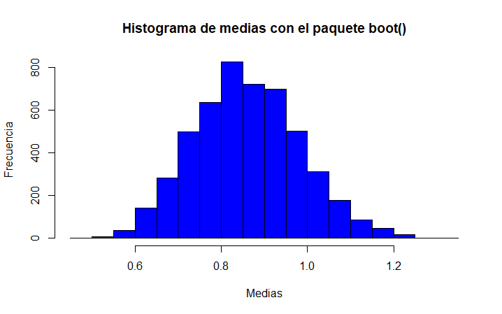

# Postwork Sesión 4.

#### Objetivos

El objetivo de este postwork es investigar la dependencia o independecia de las variables aleatorias X y Y, que corresponden a el número de goles anotados por el equipo de casa y el número de goles anotados por el equipo visitante con los que hemos trabajado en postworks anteriores.

#### Sobre la independencia en probabilidad

La definición de **independencia** en teoría de probabilidad podemos encontrarla enunciada como:

*"Dos eventos son independientes si la probabilidad de que ocurran ambos simultáneamente es igual al producto de las probabilidades de que ocurra cada uno de ellos."*

En otras palabras:

*"Dos eventos son independientes si la probabilidad conjunta es igual al producto de las probabilidades marginales independientes."*

Matemáticamente:

<p align="center">

</p>

Si son iguales, es lógico decir que el cociente de ambos sea igual a 1:

<p align="center">

</p>

De esta forma podemos garantizar la **independencia** de ambas variables.

#### Desarrollo

En el [Postwork03](/Postwork3/) estimamos las probabilidades conjuntas de que el equipo de casa anote X goles, y el equipo visitante anote Y goles, en un partido. Por lo que el siguiente paso para verificar independencia sería obtener el producto de las probabilidades marginales. Haciendo uso de nuestro archivo `.csv` diseñamos el data frame y cargamos las bibliotecas `ggplot2()` y `dplyr()`:

```R
library(dplyr)
library(ggplot2)
setwd("C:/.../DataSets")
data <- read.csv("resultado.csv")

goles <- select(data, FTHG, FTAG)
goles_tabla <- table(goles)

goles_casa <- margin.table(goles_tabla,1)
goles_visita <- margin.table(goles_tabla,2)

prob.casa <- prop.table(goles_casa)
prob.visita <- prop.table(goles_visita)
prob.conjunta <- prop.table(goles_tabla)

prob.casa.df <- as.data.frame(prob.casa)
prob.visita.df <- as.data.frame(prob.visita)
prob.conjunta.df <- as.data.frame(prob.conjunta)
```
Realizar el producto de las probabilidades marginales se simplifica utilizando dos ciclo `for`, uno anidado dentro del otro:

```R
for (i in 1:length(prob.visita.df$Freq)){
  for (j in 1:length(prob.casa.df$Freq)){
    x <- data.frame( "FTHG" = j-1, "FTAG" = i-1, "Freq" = (prob.visita.df$Freq[i])*(prob.casa.df$Freq[j]))
    if (i==1 && j==1 ){
      prob.producto.df <- x
    } else {
      prob.producto.df <- rbind(prob.producto.df,x)
    }
    
  }
}
```
De acuerdo al tamaño de los data frame establecemos la cantidad de iteraciones, en el primer ciclo se establece la estructura del data frame que será similar a los anteriores con los goles jugando en casa `FTHG`, goles como visitante `FTAH` y la probabilidad `Freq`. En el resto de ciclos se iran añadiendo filas al dataframe para las combinaciones de goles restantes. Inspeccionamos ambos data frame:

```R
prob.producto.df
prob.conjunta.df
```

Con ambas probabilidades calculadas, podemos dividir ambas y obtener coeficientes con los cuales verificar la independencia de las variables. Para una mejor observación de los coeficientes y de que combinaciones de los goles de casa (X) y goles de visita (Y) provienen, se diseña un data frame que contenga toda esta información:

```R
coef <- (prob.conjunta.df$Freq)/(prob.producto.df$Freq)
coef.df <- data.frame( "FTHG" = prob.conjunta.df$FTHG , "FTAG" = prob.conjunta.df$FTAG , "Conjun" = prob.conjunta.df$Freq, 
                       "Prod" = prob.producto.df$Freq,"Coef" = coef )
```

Inspeccionando un poco el data frame:

```R
head(coef.df)
tail(coef.df)
```

La consola muestra:

<p align="center">

</p>

Observamos algunos valores de los coeficientes, sin embargo podemos obtener más información analizando estos datos si obtenemos el promedio y la desviación estándar, junto a un histograma que muestre la frecuencia con la que se distribuyen:

```R
mean(coef)
sd(coef)
coef.df %>%
  ggplot() + 
  aes(Coef) +
  geom_histogram(bins = 16, col="black", fill = "green") + 
  ggtitle("Histograma de Mediciones") +
  ylab("Frecuencia") +
  xlab("Coeficientes") + 
  theme_light()
```
Sabemos entonces que los coeficientes tienen una media con valor de 0.8595708 y los valores de los coeficientes se alejan de la media aproximadamente en 0.9801441. y el histograma siguiente nos muestra de una manera más gráfica que la mayoría de los coeficientes tienen valores entre 0 y 2:

<p align="center">

</p>

También podemos observar que los coeficientes con valor 0 tienen una alta frecuencia y que valores superiores a 2 tienen muy poca frecuencia. Esto tiene una explicación algo sencilla desde el punto de vista futbolístico:

- **Muchos coeficientes 0**: Si el coeficiente vale cero, esto quiere decir que la probabilidad conjunta vale 0 y al realizar la división también le da un valor 0. Esto sucede cuando el marcador finaliza con resultados difíciles de alcanzar, como goleados 7-1 o partidos muy reñidos 5-4. 
- **Coeficientes superiores a 2**: Esto se da cuando la probabilidad conjunta es mucho más grande que el producto de las marginales. Por ejemplo el marcador 8-2 tiene una probabilidad conjunta baja (0.000877), pero las probabilidades marginales son aún más bajas (1.862e-04). Traduciendo esto, podemos decir que en conjunto es muchisimo más fácil que el marcador en general términe 8-2 en diferentes partidos, a que en un solo partido anotemos 8 goles.

Con solo esta información podriamos discutir la independencia de nuestros eventos. Pero tenemos muy pocos datos con los cuales realizar una afirmación sólida, aquí entra en juego el método boostrap.

#### El método bootstrap: *"Una tarea imposible"*.


*"El nombre tiene relación con la especie de correas (straps, en inglés) que tienen las botas (boots, también en inglés) en su parte superior, sobre todo esas botas de vaqueros que vemos en las películas. Bootstrapping es un término que, al parecer, hace referencia a la acción de elevarse a uno mismo del suelo tirando simultáneamente de las correas de las dos botas. Como os dije, una tarea imposible gracias a la tercera ley Newton."* 

[Manuel M. Arias](https://anestesiar.org/2015/una-tarea-imposible-la-tecnica-de-bootstrapping/) 

El boostrapping es una técnica de remuestreo, donde las muestras sucesivas se extraen de nuestra muestra y no de una población, siguiendo una serie de pasos repetitivos.

- El primer paso consiste en extraer una muestra a partir de la muestra original, y esta debe extraerse utilizando un muestreo con reposición, de tal forma que algunos elementos no serán seleccionados y otros lo podrán ser más de una vez en cada muestreo.
- A partir de esta muestra inicial se obtiene el estadístico deseado y se utiliza como estimador de la población. 

Como estimador este estadístico será poco preciso, por lo que se repiten estos dos pasos un alto número de veces para obtener un alto número de estimadores. Con estos estimadores construiremos una distribución denominada **Distribución bootstrap** y que representa una aproximación de la verdadera distribución del estadístico de la población. Para que está aproximación sea fiable, la muestra original debe ser *representativa* de la población.

Para realizar el remuestreo de nuestro coeficientes podemos optar por realizar el muestro de forma *"manual"* apoyándonos de la función `sample()` y utilizando la media como estadístico:

```R
medias <- numeric(5000) #Inicializamos un vector de ceros con 5 mil elementos (tamaño de la remuestra)

for (i in 1:5000){
  muestra <- sample(coef, replace = T)
  medias[i] <- mean(muestra)
}  #Ciclo for que genera 5000 muestras con reposición y calcula la media de cada una

medias.df %>%
  ggplot() + 
  aes(Medias) +
  geom_histogram(col="black", fill = "red") + 
  ggtitle("Histograma de medias de los coeficientes r-emuestreados") +
  ylab("Frecuencia") +
  xlab("Medias") + 
  theme_light()
  
mean(medias)
sd(medias)
```

Si observamos el histograma de estas medias calculadas:

<p align="center">

</p>

Sabiendo que el valor promedio de estas medias es de 0.8596785 con una desviación estándar de 0.1236336, observamos una reducción drástica en la desviación estándar comparándola con desviacón de la muestra original mientras que la media es prácticamente la misma. Si calculamos el intervalo de confianza de las medias:

```R
quantile(medias, c(0.025, 0.975))
```

Observamos que la gran mayoría de ellas se encuentran entre 0.626881 y 1.10997. Con ayuda de este remuestreo podemos obtener mejores conclusiones.


#### Conclusiones

Con ayuda del remuestreo bootstrap la tarea de analizar muestras sin tener acceso a la población total se simplifica, en este caso pudimos obtener más coeficientes para investigar la independecia de los eventos sin necesidad de analizar más partidos. Como se mencionó en un punto anterior, la distribución está claramente centrada en 0.859, aunque en la muestra original debido a influencia de marcadores con baja probabilidad como 7-6 la desviación era grande, se podía apreciar que gran parte de los datos estaban alrededor de la media.

El bootstrap entonces nos sirvió para verificar que aún remuestreando los coeficientes, la media siempre sería prácticamente la misma e inclusive la dispersión era manor. Esto quiere decir que aún se realizen muchos partidos, las probabilidades tanto conjuntas como marginales de marcadores bajos tienen mayor peso y centran la distribución de los coeficientes alrededor de 0.859.

Entonces, como conclusión, podemos rechazar la independecia de las variables X (goles de casa) y Y (goles de visita), esto gracias al remuestreo bootstrap que nos permitió observar el comportamiento de los coficientes y como estos están alejados del valor ideal 1. 

#### El paquete boot()

El paquete `boot` incluye algunas funciones de utilidad para el cálculo de la distribución bootstrap, primero lo cargamos y creamos un data frame que contenga la muestra original:

```R
library(boot)
coefdf <- data.frame(coef) #Data frame auxiliar de los coeficientes obtenidos como primera muestra
```

La función `boot()` realiza el remuestreo del estadístico indicado, creamos una función `media` como estadístico que obtenga la media del data frame auxiliar:

```R
media <- function(coefdf, cocientes)
{
  d=coefdf[cocientes,]
  mean(d)
}
```

Aplicamos la función `boot()` indicando el data frame sobre el que hará el remuestreo, el estadístico y el número de veces que se hará:

```R
replicas <- boot(data=coefdf, statistic = media, R=5000)
```

La variable replicas es de clase `boot`, observamos algunos de los parámetros resultates con `names()`:

```R
names(replicas)
```

Para acceder a las medias calculadas utilizamos el signo `$` como en los data frame y el campo `t` que contiene el resultado de aplicar el estadístico al bootstrap. Podemos conocer el promedio y la desviación estándar, además del histograma de frecuencias: 

```R
mean(replicas$t)
sd(replicas$t)
hist(replicas$t)
```

El promedio de las medias es 0.8601392 y la desviación estándar es de 0.1236591, valores muy similares a los obtenidos on el procedimiento *"manual"*. El histograma obtenido es el siguiente:

<p align="center">

</p>

Contamos entonces con más herramientas para aplicar el método bootstrap a grandes cantidades de datos.
