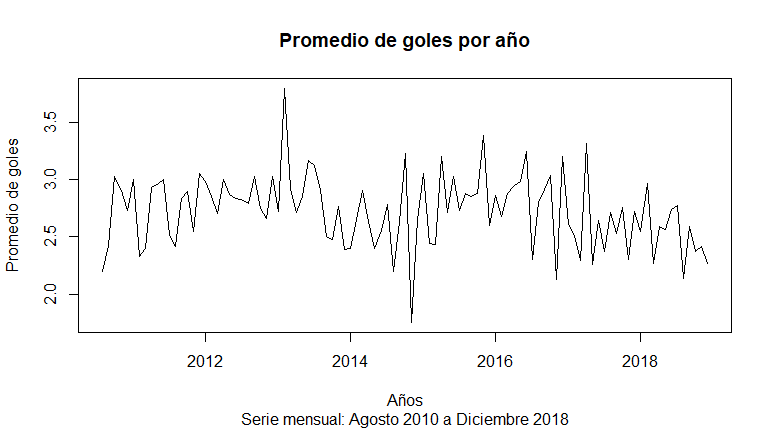

# Postwork Sesión 6. 

#### Objetivos

Importar el conjunto de datos match.data.csv a `R` y realizar lo siguiente:

1. Agregar una nueva columna `sumagoles` que contenga la suma de goles por partido.

2. Obtener el promedio por mes de la suma de goles.

3. Crear la serie de tiempo del promedio por mes de la suma de goles hasta diciembre de 2019.

4. Graficar la serie de tiempo.

#### Desarrollo

El primer paso para desarrollar el postwork es importar los datos del archivo `csv`, establecemos el directorio de trabajo y asignamos el archivo con la función `read.csv()` que nos devolverá un data frame el cual inspeccionaremos un poco con la función `str()`:

```R
setwd("C:/.../DataSets")
df <- read.csv("match.data.csv")
str(df)
```

Para añador una nueva columna, con ayuda del paquete `dplyr` y la función `mutate()` añadimos un nuevo campo que sea la suma de goles de casa y goles de visita:

```R
library(dplyr)
df <- mutate(df, sumagoles = (home.score+away.score))
```
Para obtener el promedio por mes, debemos manipular la información del campo `Date`, para poder hacer esto lo convertiremos de un dato de tipo factor a tipo fecha:

```R
df <- mutate(df, date = as.Date(date, "%Y-%m-%d"))
```

Ahora nos apoyamos del paquete `lubridate` que nos facilita el tratamiento de fechas en R, con la función `floor_date()` indicamos que se deben redondear las fechas al mes inmediato:

```R
library(lubridate)
df <- mutate(df, month= floor_date(df$date, "month"))
df2 <- select(df, sumagoles,month)
```

Teniendo ahora los campos necesarios para obtener el promedio, realizamos una operación *pipe* en la que a partir del **df2** agruparemos por mes el promedio de los goles y lo guardaremos en **df3**:

```R
df3 <- df2 %>% group_by(month) %>%
  summarize(promedio=mean(sumagoles
```

Ahora podemos crear la serie de tiempo y graficarla, los valores promedio están en la segunda columna de **df3** y gracias a la inspección inicial sabemos que los datos se tomaron a partir de agosto del 2010 e indicamos que una frecuencia de 12 correspondiente a los meses del año:

```R
st <- ts(df3[,2], start = c(2010,8),freq=12)
plot.ts(st, main = "Promedio de goles por año", xlab ="Años",
        ylab = "Promedio de goles", sub = "Serie mensual: Agosto 2010 a Diciembre 2018")
```

El gráfico resultante es:

<p align="center">

</p>

<br/>

[`Anterior`](../Postwork5) | [`Siguiente`](../Postwork7)      

</div>
