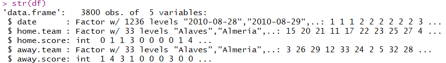
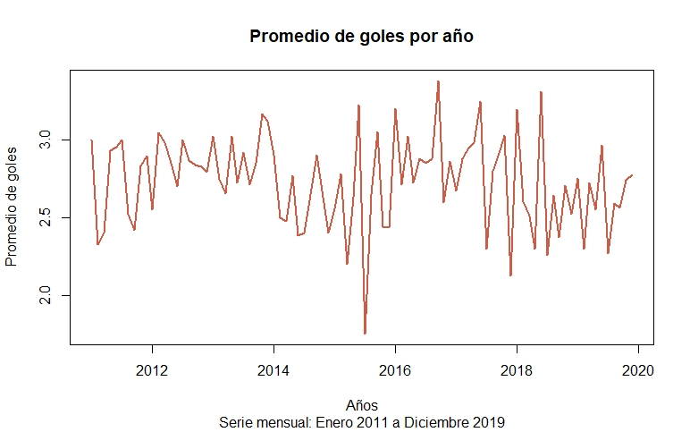

# Postwork Sesión 6. 

#### Objetivos

Importar el conjunto de datos match.data.csv a `R` y realizar lo siguiente:

1. Agregar una nueva columna `sumagoles` que contenga la suma de goles por partido.

2. Obtener el promedio por mes de la suma de goles.

3. Crear la serie de tiempo del promedio por mes de la suma de goles hasta diciembre de 2019.

4. Graficar la serie de tiempo.

#### Desarrollo

El primer paso para desarrollar el postwork es importar los datos del archivo `csv`, establecemos el directorio de trabajo y asignamos el archivo con la función `read.csv()` que nos devolverá un data frame el cual inspeccionaremos un poco con la función `str()`:

```R
setwd("C:/.../DataSets")
df <- read.csv("match.data.csv")
str(df)
```
La inspección muestra que algunos columnas como la fecha son de tipo factor:

<p align="center">

</p>

Para añadir una nueva columna, con ayuda del paquete `dplyr` y la función `mutate()` añadimos un nuevo campo que sea la suma de goles de casa y goles de visita:

```R
library(dplyr)
df <- mutate(df, sumagoles = (home.score+away.score))
```
Para obtener el promedio por mes, debemos manipular la información del campo `Date`, para poder hacer esto lo convertiremos de un dato de tipo factor a tipo fecha:

```R
df <- mutate(df, date = as.Date(date, "%Y-%m-%d"))
```

Ahora nos apoyamos del paquete `lubridate` que nos facilita el tratamiento de fechas en R, con la función `month()` y la función `year()` extraemos el mes y el año:

```R
library(lubridate)
df <- mutate(df, month= month(date))
df <- mutate(df, year= year(date))
df2 <- select(df, sumagoles, month, year)
```

Teniendo ahora los campos necesarios para obtener el promedio, realizamos una operación *pipe* en la que a partir del **df2** agruparemos por año y mes el promedio de los goles y lo guardaremos en **df3**:

```R
df3 <- df2 %>% group_by(year,month) %>%
  summarize(promedio=mean(sumagoles))
```

### Consideraciones
Las temporadas de futbol de la liga española generalmente se juegan de agosto a mayo duranto en total 10 meses, en los datos de nuestro archivo `csv` nos encontramos con diferentes circustancias. En el año 2013 se jugó hasta junio durando 11 meses esta temporada y en el año 2020 la temporada se vio interrumpida en marzo por las circustancias derivadas de la pandemia por COVID-19.

En base a esto y teniendo como objetivo de crear la serie de tiempo hasta diciembre de 2019, decidimos conservar los datos en en base a 10 meses pero empezando desde enero del 2011 hasta diciembre del 2019 e ignorando el mes extra jugado en 2013. Teniendo así datos de 10 meses por año, para cumplir esto utilizamos la función `filter()`:

```R
df4 <- filter(df3, month %in% c(8,9,10,11,12,1,2,3,4,5))
df5 <- filter(df4, year !=2010, year != 2020)
```

Con los datos filtradosAhora crear la serie de tiempo y graficarla, los valores promedio los extraemos de **df5** y gracias a la inspección sabemos que los datos se tomaran a partir de enero del 2011 e indicamos que una frecuencia de 10 correspondiente a los meses que se jugaron:

```R
st <- ts(df5$promedio, start = c(2011,1),freq=10)
plot.ts(st, main = "Promedio de goles por año", xlab ="Años",
        ylab = "Promedio de goles", sub = "Serie mensual: Enero 2011 a Diciembre 2019"
        ,col = "coral3",lwd = 2)
```

El gráfico resultante es:

<p align="center">

</p>

<br/>

[`Anterior`](../Postwork5) | [`Siguiente`](../Postwork7)      

</div>
