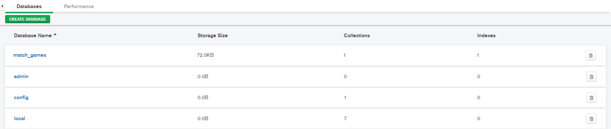
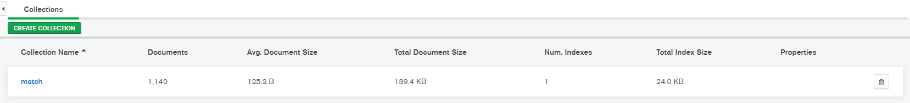
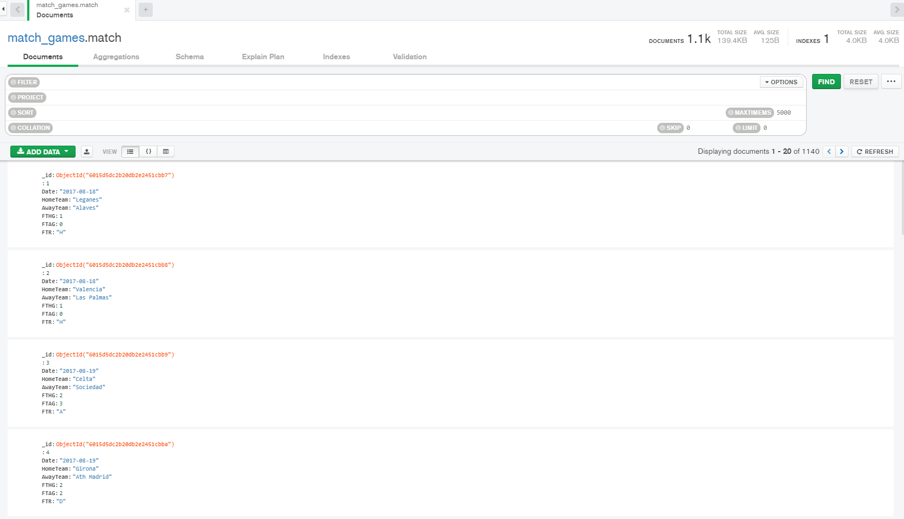
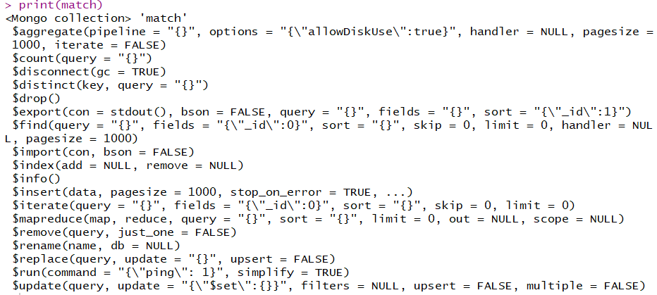
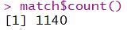
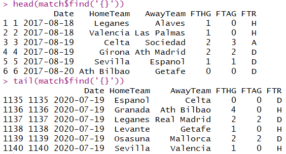
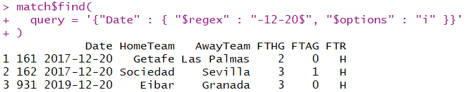
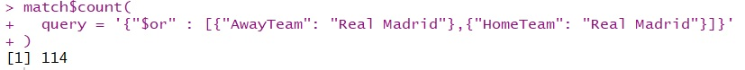

# Postwork Sesión 7. 

#### Objetivos


Utilizando el manejador de BDD _Mongodb Compass_ (previamente instalado), deberás de realizar las siguientes acciones: 

- Alojar el fichero  `data.csv` en una base de datos llamada `match_games`, nombrando al `collection` como `match`

- Una vez hecho esto, realizar un `count` para conocer el número de registros que se tiene en la base

- Realiza una consulta utilizando la sintaxis de **Mongodb**, en la base de datos para conocer el número de goles que metió el Real Madrid el 20 de diciembre de 2015 y contra que equipo jugó, ¿perdió ó fue goleada?

- Por último, cerrar la conexión con la BDD

#### Desarrollo

El primer paso para desarrollar este postwork fue crear la base de datos `match_games` desde **MongoDB Compass**:

<p align="center">

</p>

Después se creo la colección `match`:

<p align="center">

</p>

Finalmente se subio el archivo `data.csv` a la colección de nuestra base de datos, observamos que hay un total de **1140** documentos :

<p align="center">

</p>

Ahora para conectarnos a nuestra base de datos desde R, lo primero que necesitamos es instalar el paquete [`mongolite`](https://jeroen.github.io/mongolite/) para su uso:

```R
install.packages("mongolite")
library(mongolite)
```

Al igual que con **MongoDB Compass**, realizar la conexión necesita de la dirección del servidor MongoDB en formato de cadena [URI](https://docs.mongodb.com/manual/reference/connection-string/) :

```R
mi url <- "mongodb://[username:password@]host1[:port1][,host2[:port2],...[/[database][?options]]"
```

Esta URL es un parámetro de la función `mongo()` que permite la conexión a una colección de MongoDB, otros parámetros necesarios son el nombre de la base de datos y el nombre de la colección:

```R
match <- mongo(collection = "match",
           db = "match_games", 
           url = mi_url)
print(match)           
```

*match* es un objeto de conexión a mongo, podemos dar un vistazo a los métodos de este objeto imprimiéndolo en la consola:

<p align="center">

</p>

Es de nuestro interés el método `count()`, el cual devuelve el número de documentos contenidos en nuestra colección:

```R
match$count()
```

El cual coincide con lo observado en **MongoDB Compass**:

<p align="center">

</p>

Para realizar consultas desde R, podemos recurrir a los diferentes métodos de los objetos de conexión a mongo, utilizando sintaxis [JSON](https://docs.mongodb.com/manual/tutorial/query-documents/). Uno de estos métodos es `find()` el cual nos permite encontrar aquellos documentos que satisfacen nuestra consulta. 

Una ventaja de los métodos del paquete `mongolite` es que devuelven data frames que podemos manipular e inspeccionar con las funciones locales de R, si realizamos una consulta vacía `{}` se nos devolverán todos los documentos de la colección, si queremos observar los primeros y últimos documentos podemos ejecutar:

```R
head(match$find('{}'))
tail(match$find('{}'))
```

En la consola se muestra:

<p align="center">

</p>

Para encontrar el número de goles que anotó el Real Madrid el 20 de diciembre de 2015, podemos realizar una primera consulta que nos diga si hubo partidos ese día:

```R
match$find(
  query = '{"Date": "2015-12-20"}'
)
```

Observamos que se nos devuelve un data frame vacío, ya que no hubo un resultado que coincidiera con la consulta:

<p align="center">

</p>

Podemos recurrir a realizar una consulta con una expresión regular [`$regex`](https://docs.mongodb.com/manual/reference/operator/query/regex/):

```R
match$find(
  query = '{"Date" : { "$regex" : "-12-20$", "$options" : "i" }}'
)
```

Vemos que se jugaron 3 partidos un 20 de diciembre, pero ninguno fue en el año 2015:


<p align="center">

</p>

Entonces carecemos de información que nos diga si el 20 de diciembre de 2015 el Real Madrid perdió o dio una goleada. Pero tenemos acceso a información del Real Madrid como el total de partidos desde agosto de 2017 a julio del 2020:

```R
match$count(
  query = '{"$or" : [{"AwayTeam": "Real Madrid"},{"HomeTeam": "Real Madrid"}]}'
)
```
Siendo 114 partidos en total:

<p align="center">

</p>

Para resolver la incógnita sobre el marcado del Real en esa fecha, proponemos incluir la información de la temporada 2015-2016 de la [`Liga Española`](https://www.football-data.co.uk/spainm.php) en primera división. Esta se encuentra en el data set **SP2015_2016.csv**:

```R
setwd("C:/.../DataSets")
SP2015_2016 <- read.csv("SP2015_2016.csv")

```

Ajustamos el formato de la fecha y seleccionamos los campos para que coincidan con el resto de documentos de nuestra colección:

```R
library(dplyr)
P2015_2016 <- mutate(SP2015_2016, Date = as.Date(Date, "%d/%m/%y"))

SP2015_2016 <-SP2015_2016 %>% 
  select(Date,HomeTeam,AwayTeam,FTHG,FTAG,FTR)
```

Con el método `$insert` podemos añadir un data frame directamente a la colección, siendo cada registro un documento:

```R
match$insert(SP2015_2016)  
```
Realizamos nuevamente el conteo de documentos, el cual se ha incrementado a 1520 ya que el data set contenía 380 filas:

```R
match$count()
```

<p align="center">

</p>

Consultamos de nuevo la fecha deseada y encontramos que se realizaron varios partidos ese día:

```R
match$find(
  query = '{"Date": "2015-12-20"}'
)
```
<p align="center">

</p>

Buscamos si en esa fecha el Real Madrid jugó como visitante o en casa

```R
match$find(
  query = '{"$and" : [{"Date": "2015-12-20"},
  {"$or" : [{"AwayTeam": "Real Madrid"},{"HomeTeam": "Real Madrid"}]}]}'
)
```
Encontramos entonces un resultado, y vemos que el Real Madrid ganó por goleada 10 a 2 contra el Vallecano:

<p align="center">

</p>

Podemos verificar la consulta desde **Mongo Compass**:

<p align="center">

</p>

Finalmente para desconectarnos de la base de datos utilizamos el método `$disconnect()` para cortar la conexión con la colección y la función `rm()` para eliminar el objeto de tipo mongo que provino del ambiente de `mongolite`:

```R
match$disconnect( gc = TRUE)
rm(match)
```

<br/>

[`Anterior`](../Postwork6) | [`Siguiente`](../Postwork8)      

</div>
