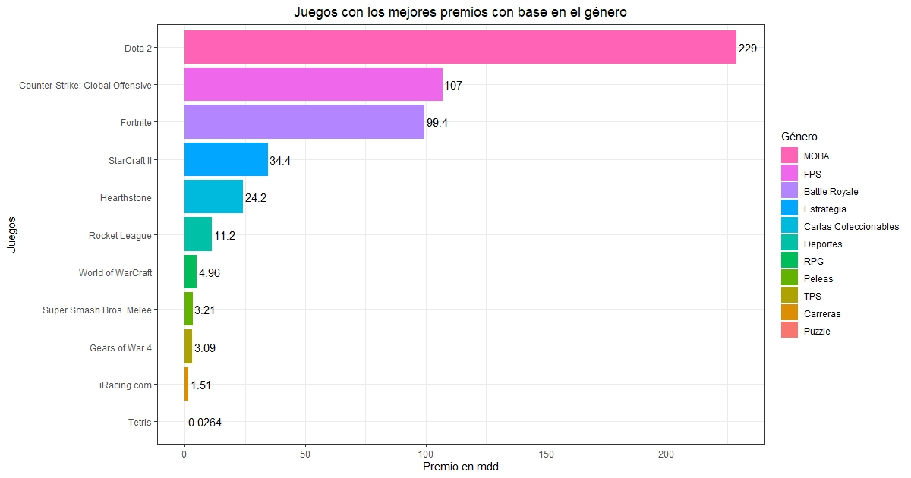
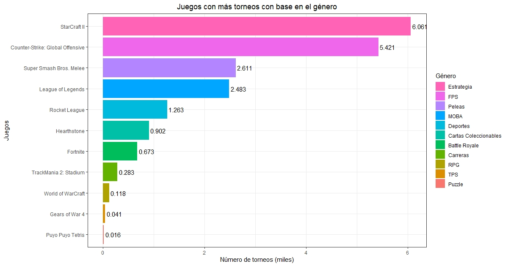

# Géneros: ¿Qué juegos han dado los mejores premios?¿Qué juegos han tenido más torneos?

*Todos los eSports son videojuegos pero no todos los videojuegos son eSports.*

Aunque en un sentido estricto, cualquier videojuego puede formar parte de un encuentro competitivo, no todos los videojuegos tienen el rango de deporte electrónico. Entre los millos de juegos que hay, apenas unos cuantos son considerados deportes electrónicos, algunas características que comparten los juegos considerados eSport:

1. El juego permite el enfrentamiento directo entre dos o más participantes.
2. Los jugadores compiten en igualdad de condiciones, siendo la victoria exclusivamente determinada por la habilidad de estos.
3. Existen ligas y competiciones oficiales reguladas con reglas y formadas por equipos y jugadores profesionales.
4. Goza de popularidad y de ser competitivo. Es decir, cuenta con miles de personas jugando y medios de comunicación retransmiten las competiciones.Existen ligas y competiciones oficiales reguladas con reglas y formadas por equipos y jugadores profesionales.
5. Debe promover el deseode superación.

Además los videojuegos considerados eSports no se limitan a un solo género de videojuegos, algunos de los más presentes en la escena competitiva son:

- Multiplayer Online Battle Arena (MOBA)
- First Person Shooter (FPS)
- Battle Royale
- Estrategia
- Peleas

Después de observar los datos de nuestros dataset y aprender un poco más sobre los géneros de eSports, podemos plantear un par de preguntas referentes a los géneros de videojuegos de los que se han realizado competencias:

- ¿Qué juegos han dado los mejores premios?
- ¿Qué juegos han tenido más torneos?

Para responder a ambas incógnitas, e inclusive un par más, construimos la función `best_genero()`.

### best_genero()

Está función trabaja con el data frame `general`, en el cual vienen los datos ponderados referentes a torneos, participantes y ganancias por juegos y géneros. En primera instancia, para una mejor exposición de nuestros resultados, decidimos cambiar los registros de los géneros por sus traducciones al español o acrónimos más fáciles de leer:

```R
general$Genre <- gsub(" Game","",general$Genre) #Recortamos la palabra
general$Genre[which(general$Genre == "Multiplayer Online Battle Arena")] <- "MOBA"
general$Genre[which(general$Genre == "Role-Playing")] <- "RPG"
general$Genre[which(general$Genre == "Third-Person Shooter")] <- "TPS"
general$Genre[which(general$Genre == "First-Person Shooter")] <- "FPS"
general$Genre[which(general$Genre == "Strategy")] <- "Estrategia"
general$Genre[which(general$Genre == "Collectible Card")] <- "Cartas Coleccionables"
general$Genre[which(general$Genre == "Sports")] <- "Deportes"
general$Genre[which(general$Genre == "Fighting")] <- "Peleas"
general$Genre[which(general$Genre == "Racing")] <- "Carreras"
```

Gracias a funciones como `gsub()` y `which()` el procedimiento resulta bastante sencillo. Ahora bien, el data frame `general` posee 4 campos que podemos agrupar por género, pero solo dos nos interesan:

- TotalTournaments: Torneos totales de cada juego.
- TotalEarnings: Ganancias totales otorgadas como premio de cada juego.

Obtener un agrupamiento para estas variables y a partir de ellos realizar un gráfico es un proceso similar en ambos los casos, por lo que para reducir significativamente la cantidad de código se optó para crear una función que devuelva un gráfico construido de acuerdo al campo deseado:

```R
best_genero <- function(Dato){
```

Donde `dato` es una variable de tipo carácter que servira para filtrar el campo deseado. Esto se logra con `contains()` dentro de la función `select()` del paquete `dplyr`, además seleccionamos el campo Genre (ya que es sobre él que vamos a realizar un agrupamiento) y el campo Game para conocer el juego *top*:

```R
df <- general %>% select(Genre,Game,contains(Dato)) 
```

La siguiente estapa de la función es una serie de condiciones, dependiendo de la entrada `dato` se utilizarán ciertas variables para la construcción del gráfico correspondiente, las condiciones siguen una estructura general que se comenta a continuación:

```R
if (Dato == "TotalTournaments"){                                                        #Si se solicitó el gráfico de torneos se entra a la condición
    base <- 1e03                                                                        #Se crea una variable del orden de miles
    df <- df %>% group_by(Genre) %>% filter( TotalTournaments == max(TotalTournaments)) #Se agrupa por género el registro con la máxima cantidad de torneos
    df <- df %>% mutate( Mejor = (TotalTournaments/base))                               #Los torneos se pasan al orden de miles y renombramos la columna como "Mejor"
    xlabel <- "Número de torneos (miles)"                                               #Se declaran etiquetas y título para el gráfico correspondiente
    ylabel <- "Juegos"
    title <- "Juegos con más torneos con base en el género"
  } 
  if (Dato == "TotalEarnings"){
    base <- 1e06
    df <- df %>% group_by(Genre) %>% filter( TotalEarnings == max(TotalEarnings))
    df <- df %>% mutate( Mejor = signif((TotalEarnings/base),3))
    xlabel <- "Premio en mdd"
    ylabel <- "Juegos"
    title <- "Juegos con los mejores premios con base en el género"
  }

```

Una vez filtrados y tratados los datos de acuerdo al campo solicitado, así como declarados los elementos gráficos correspondientes, se presentan arreglos para la exposición de los datos en forma descendente, es decir del valor máximo al valor mínimo. Para que `ggplot` respete este orden, modificamos los campos Genre y Game de tipo factor, reordenando los niveles de acuerdo a la nueva jerarquía:

```R
  df <- df %>% arrange(desc(df[3]))    #La función arrage arreglará la tercer columna de df (df[3] == df$Mejor) en formato descendente
  
  df$Game <- factor(df$Game,                                
                    levels = df$Game[order(df[3])])      #Ordenamos los niveles de los factores de los campos de juego y género
  
  df$Genre <- factor(df$Genre,
                     levels = df$Genre[order(df[3])])    #Ambos tendrán la jerarquía de "Mejor".
```

Por último, realizamos un gráfico de barras con `ggplot`, 

```R
  graph <- ggplot(df, aes_string( "Mejor", y= "Game", fill= "Genre" ))+       #Declaramos las estéticas
    geom_col()+                                                               #Establecemos el tipo de gráfico como gráfico de columnas                 
    guides(fill = guide_legend(reverse=T, title = "Género"))+                 #Invertimos el orden de la leyenda y le damos un título
    xlab(xlabel)+ylab(ylabel)+ggtitle(title)+                                 #Asignamos las etiquetas declaradas en las condiciones
    geom_text(aes(label = Mejor),hjust = -0.1)+                               #Mostramos el valor de cada columna
    theme_bw()+                                                               #Colocamos un fondo blanco
    theme(plot.title = element_text(hjust = 0.5))                             #Centramos el título

  
  return(graph)                                                               #Regresamos el gráfico como resultado de la función
  
}
  
```

La forma indicada de llamar a la función para cada campo es la siguiente:

```R
(best_genero("TotalEarnings"))
(best_genero("TotalTournaments"))
```

Siendo los primeros dos campos los que nos ayudarán a responder las preguntas clave.

### Resultados 

Los gráficos que responder a las preguntas clave son:

### ¿Qué juegos han dado los mejores premios?

<p align="center">

</p>

Encontramos a Dota 2 siendo el líder con un premio de 229 millones de dólares, seguido de juegos como Counter Strike: Global Offensive y Fortnite con premios alrededor de los 100 millones de dólares en sus respectivos géneros. La lista baja hasta encontrarnos con Tetris en el género de Puzzle dando un premio nada despreciable de 26,400 dólares. 

### ¿Qué juegos han tenido más torneos?

<p align="center">

</p>

StarCraft II ha sido sin duda un pilar para los eSports, esto se ve reflejado en su popularidad y cantidad de torneos realizados, con un total de 6.061 mil torneos. Del género de MOBA encontramos al popular e influyente League of Legends con 2.483 mil torneos y nuevamente encontramos al género de puzzle en último lugar, con Puyo Puyo tetris y 16 torneos como máximo del género.
