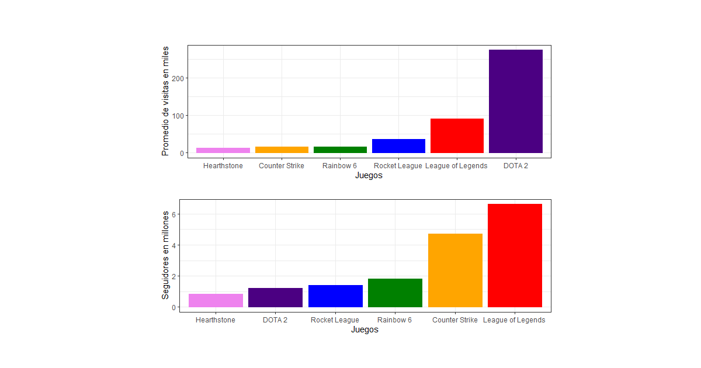

# Streaming: Juegos con más seguidores y su promedio de visitas

Para analizar los juego que más seguidores tienen y el promedio de vistas que siguen es necesario hacer uso de otro de nuestros dataset que hasta al momento no se han utilizado `twitchdata-update.csv`, el cual renombramos solamente con el nombre de twitch.
Este dataset es muy importante, ya que, como ya se mencionó en los anteriores apartados, twitch es la plataforma más importante en la difusión de los Esports.

Con este dataset realizaremos una función, llamada:

### twitch.juegos()

Esta función nos devolverá los juegos con un mayor promedio de vistas y con más seguidores dentro de la plataforma de twitch, para entender esto prosigamos con el código-

```R
#Creamos la función que almacena los juegos con un mayor promedio de vistas y seguidores
twitch.juegos <- function(){

#Dentro del dataset, extraeremos información sobre ciertos canales, dónde buscamos coincidencias a través de la función grep() 

LOL <- twitch %>% slice(grep("Riot", twitch$Channel)) 
DOTA <- twitch %>% slice(grep("dota2ti",twitch$Channel))
df4 <- twitch %>% slice(grep("Rainbow", twitch$Channel))
df5 <- twitch %>% slice(grep("R6", twitch$Channel))
R6 <- rbind.data.frame(df4,df5)                                           #df4 y df5 representan al mismo juego, se hace su conjunción
RL <- twitch %>% slice(grep("RocketLeague", twitch$Channel))
CSGO <- twitch %>% slice(grep("ESL_CSGO", twitch$Channel))
HS <- twitch %>% slice(grep("Hearthstone", twitch$Channel))
```

Los canales hallados, cada uno tiene una coincidencia particular y es que pertenecen al mismo juego, para cada juego creamos un dataframe, dónde almacenaremos el promedio en visitas y el número de seguidores que posee. Al final todos estos serán almacenados en un dataframe.

```R
LOL <-data.frame(Juego = "League of Legends", 
                 Prom.Vistas =sum(LOL$Average.viewers), Seguidores = sum(LOL$Followers))

DOTA <- data.frame(Juego = "DOTA 2", 
                   Prom.Vistas =sum(DOTA$Average.viewers), 
                   Seguidores = sum(DOTA$Followers))

R6 <-data.frame(Juego = "Rainbow 6", 
                Prom.Vistas =sum(R6$Average.viewers), Seguidores = sum(R6$Followers))

RL <- data.frame(Juego = "Rocket League", 
                 Prom.Vistas = RL$Average.viewers, Seguidores = RL$Followers)

CSGO <- data.frame(Juego = "Counter Strike", 
                   Prom.Vistas =sum(CSGO$Average.viewers), Seguidores = sum(CSGO$Followers))

HS <- data.frame(Juego = "Hearthstone", 
                 Prom.Vistas = HS$Average.viewers, Seguidores = HS$Followers)

#Finalmente creamos un dataframe que almacene los diferentes juegos con las características mencionadas
df2 <- rbind.data.frame(LOL,DOTA,R6,RL,CSGO,HS)
```

Una vez agruapado todo en un dataframe, se prosigue a graficar. 
```R
#Creamos un vector de colores 
colores =  c("#ff0000","#4b0082","#008000","blue","#ffa500","#ee82ee") 

#Guardamos los gráficos en dos variables, estos se realizan en ggplot, donde incluimos en el eje "x" el juego, mientras 
#que en ele "y" se le asigna en un grafico al promedio de vistas y en el otro al número de seguidores

bar1 <- ggplot(df2, aes(x=reorder(Juego,Prom.Vistas),y=Prom.Vistas/1000,))+             
  geom_bar(stat="identity", color = colores, fill =  colores)+
  labs(x = "Juegos", y = "Promedio de visitas en miles" )+ 
  theme_bw()

bar2 <- ggplot(df2, aes(x=reorder(Juego,Seguidores),y=Seguidores/10^6, fill = Juego))+
  geom_bar(stat="identity", color = colores, fill = colores   )+
  labs(x = "Juegos", y = "Seguidores en millones" )+
  theme_bw()

```

Agreamos estás variables a un panel para ser gráficas

```R
figure1 <- multi_panel_figure(columns = 2, rows = 2, panel_label_type = "none")     #Creamos el panel

figure1

figure1 %<>%
  fill_panel(bar1, column = 1:2, row = 1) %<>%        #Asignamos a cada grafico su posición
  fill_panel(bar2, column = 1:2, row = 2)
figure1                                               #Mándamos a llamar al panel con los gráficos


}
twitch.juegos()
```

<p align="center">

</p>

### Resultados
Podemos notar que el juego con más vistas es Dota2 con más de 250 mil visitas, seguido por muy detrás por League of Legends, con alrededor de 100 mil visitas en promedio, estos dos juegos pertenecen al genero de MOBA, el cual entrega la mayor cantidad de premios.
Por otra parte el juego que cuenta con mayor cantidad de seguidores es League of Legends con más de 6 millones de seguidores.
