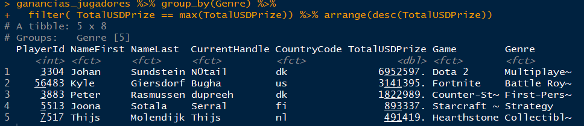
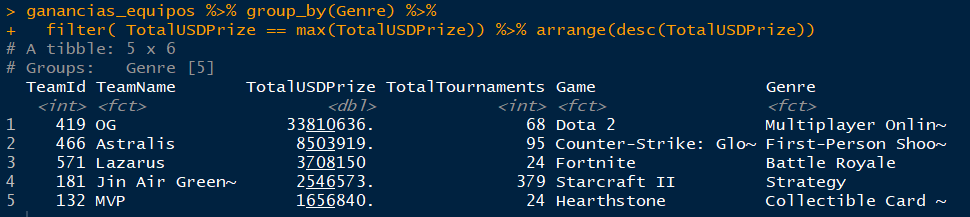
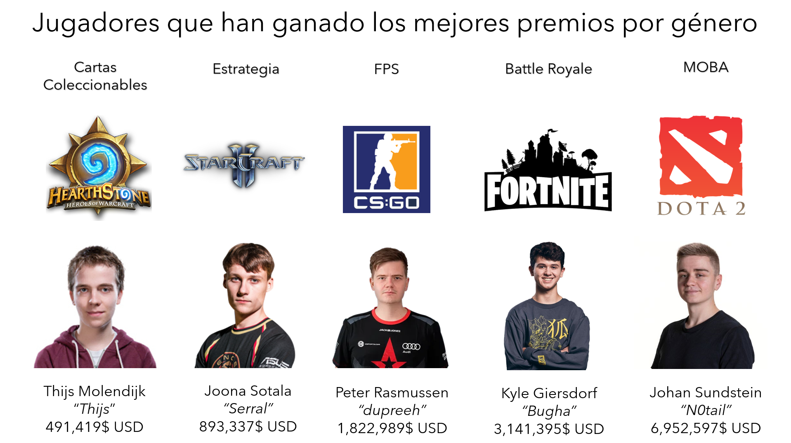
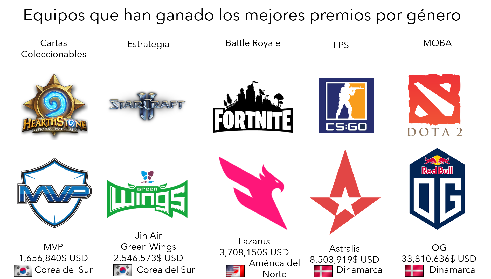

# Jugadores y equipos: ¿Cuáles ganan más dinero?

Cada vez surgen más [estudios](https://www.marca.com/esports/2016/03/15/56e81056ca474115778b4691.html) que demuestran que los jugadores de esports se ven sometidos a un desgaste similar al de los deportistas tradicionales. El último, realizado por la Universidad Alemana del Deporte en Colonia, revelaba que en intensas partidas profesionales los jugadores de esports generan niveles de estrés similares a los que generan conductores profesionales en carreras. El estudio concluía que *“Los esports son tan exigentes como muchos otros tipos de deporte, sino más."*

Todo este esfuerzo por parte de los jugadores se ve reflejado en cuantiosos premios que se llevan, ya sea de forma individual o en equipo. Para encontrar aquellos que ganan más dinero, haremos uso de los dataset  `highest_earnings_players.csv` y `highest_earnings_temas.csv` en las `variables ganancias_jugadores` y `ganancias_equipos` respectivamente.

### Pequeñas *consultas*, grandes resultados

Antes de observar los astrónomicos premios que se llevan algunos jugadores, podemos buscar las ganancias medias que ellos se llevan en los distintos géneros:

```R
#Media de ganancias por géneros de un jugador
ganancias_jugadores %>% group_by(Genre) %>%
   summarise( Media = mean(TotalUSDPrize)) %>% arrange(desc(Media))
   
```

<p align="center">

</p>

Como se ha demostrado en resultados anteriores, estos géneros son los dominantes. Observamos que la media de premios va desde 135 mil dólares hasta 878 mil dólares. Pero para aspirar a los premios más grandes se necesita mucha dedicación y entrenamiento, aquellos que han demostrado lo que valen y se han llevado las cantidades más altas son:


```R
#Ganancias máximas de un jugador por género

ganancias_jugadores %>% group_by(Genre) %>% 
  filter( TotalUSDPrize == max(TotalUSDPrize)) %>% arrange(desc(TotalUSDPrize))
  
```

<p align="center">

</p>


Si llevamos a cabo el mismo agrupamiento para los equipos:

```R
#Media de ganancias por géneros de un equipo

ganancias_equipos %>% group_by(Genre) %>%
  summarise( Media = mean(TotalUSDPrize)) %>% arrange(desc(Media))
```

<p align="center">

</p>


```R
#Ganancias máximas de un equipo por género

ganancias_equipos %>% group_by(Genre) %>%
  filter( TotalUSDPrize == max(TotalUSDPrize)) %>% arrange(desc(TotalUSDPrize))
```

<p align="center">

</p>

### Resultados

Es de notarse que si bien los premios individuales son mayores en la gran mayoría de los casos, el grado de dificultad también es mucho más alto, el estilo de juego es un factor importante a la hora de desempeñarse en los eSports. Para ilustrar mejor los resultados obtenidos se elaboraron las siguientes plantillas: 


<p align="center">

</p>


<p align="center">

</p>


Para responder a la pregunta ¿Es viable convertirse en jugador profesional?, si nos aproximamos desde el un punto de vista puramente ecónomico, la respuesta es totalmente afirmativa, un salario medio es más que suficiente para tener una vida digna. Pero como cualquier otro deporte, se necesita de dedicación, sacrificios, entrenamiento y amor por los videojuegos. Recuerda que lo importante es entregarse al arte, ¡El dinero llegará después¡

