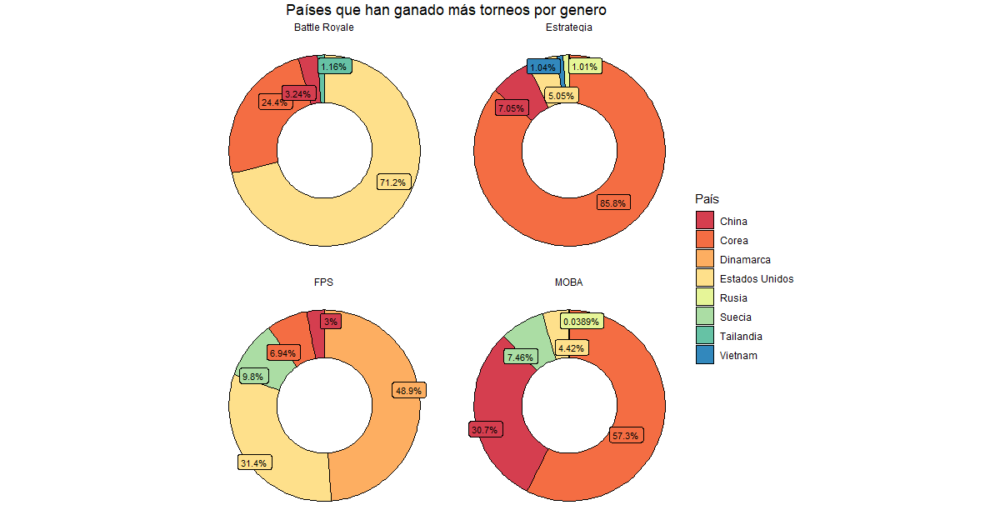

# Países: ¿Quién ha ganado más torneos?

Esta claro que los eSports al ser un fenómeno mundial, presentan competidores de todo el mundo, y como se ha visto en otros deportes, la lucha por el ser el mejor ha motivado a los jugadores a enfrentarse entre ellos para medir sus habilidades y así encontrar al mejor. 

Pero todos los jugadores llevan en alto la bandera de su lugar de nacimiento, entonces también nos podemos preguntar, qué países o regiones son los mejores? ¿Quién ha ganado más torneos? Para responder a esto, llevamos a cabo el siguiente análisis.

### TOP_PAISES 

Cuando se analizaron los géneros con los mejores premios, era evidente que el escenario era dominado por:

- MOBA
- FPS
- Battle Royale
- Estrategia
- Cartas Coleccionables 

Siendo este último cuenta con un premio mucho menor en proporción, y si contamos los torneos se queda muy por debajo. Entonces si buscamos competitividad podemos encontrarla en estos cuatro géneros que ofrecen las mejores recompensas por los esfuerzos de los jugadores. Para este análisis nos apoyamos del dataset `ESport_Earnings.csv` que asignamos a la variable `earnings`.

Creamos entonces un data frame con el top 4 de géneros en base al premio:

```R
#Generos que más dinero dan como premio top 4

(top <- earnings %>% group_by(Genre) %>%                   #Del dataframe, agrupamos por género
    summarise( TotalMoney = sum(TotalMoney)) %>%           #Realizamos un agrupamiento de suma del dinero como premio
    arrange(desc(TotalMoney)) %>% top_n(4, TotalMoney))    #Ordenamos descendentemente  y limitamos a 4 resultados
    
```

Ahora que tenemos los 4 géneros de interés, cambiamos el tipo de variable del campo Genre a carácter para modificar los nombres de los géneros a sus acrónimos y traducción:

```R
earnings$Genre <- as.character(earnings$Genre)
earnings$Genre[which(earnings$Genre == "Multiplayer Online Battle Arena")] <- "MOBA"
earnings$Genre[which(earnings$Genre == "First-Person Shooter")] <- "FPS"
earnings$Genre[which(earnings$Genre == "Strategy")] <- "Estrategia"
```

Ahora haremos uso de un ciclo `for` que obtendrá un agrupamiento en base a los géneros y al pais, después filtrará los pertenecientes al top, realizará una suma del total de torneos que ha ganado y lo ordenará de forma descendente:


```R
#El ciclo for realiza 4 iteraciones ya que nos interesan solo 4 géneros 

for (i in 1:4) {

  GENERO <- earnings %>% group_by(Genre, Top_Country) %>%              #Se agrupa el dataset earnings por género y país 
    filter(Genre == top$Genre[i]) %>%                                  #Se filtra el género i del top
    summarise( TournamentsCount = sum(TournamentNo)) %>%               #Se realiza una función de agrupamiento de la suma del número de torneos
    top_n(5, TournamentsCount) %>% arrange(desc(TournamentsCount))     #Se limita a los 5 resultados más altos y se ordenan descendentemente
```

El género Battle Royale solo tiene 5 países en este datase y uno de ellos es el país "None" sin participantes, debe retirarse para no confundir los resultados:
  

```R

  if(i==3){                                                            #top[3] corresponde a Battle Royale
    GENERO <- GENERO %>% filter( Top_Country!= "None")                 #Retiramos el país "None" del data frame
  }
  
```

Deseamos hacer un gráfico de anillo para representar los datos, entonces debemos obtener la proporción de cada país respecto al top 5 obtenido:

```R

  #Obtengo el porcentaje de torneos de cada país
  GENERO  <- GENERO %>%                                                                 #Con la función signif() limito el número de                                                               
    mutate( porcentaje = signif((TournamentsCount/sum(TournamentsCount))*100,3))        # digítos significativos a 3
    
```

El siguiente paso es obtener las dimensiones para el ring plot, esto es debido que un ring plot o [donut chart](https://www.r-graph-gallery.com/128-ring-or-donut-plot.html) es un gráfico de barras en cordenadas polares:

```R
 
  GENERO$max <- cumsum(GENERO$porcentaje)        #Suma acumulativa para los límites de cada elemento
  GENERO$min <- c(0, head(GENERO$max, n=-1))     #Establecemos los límites inferiores con los elementos n-1 de la parte superior
  GENERO$pos <- (GENERO$max + GENERO$min) / 2    #Se obtiene la posición espacial de las labels del ring plot como la diferencia de los límites sobre 2
  
  #Se ordena en base a los niveles de los factores que posee el porcentaje
  
  GENERO$Top_Country <- factor(GENERO$Top_Country,          
                               levels = GENERO$Top_Country[order(GENERO$porcentaje)])
                               
                               
  #Genero las labels del ring plot y añadimos el carácter de porcentaje %
  
  GENERO$label <- paste0(GENERO$porcentaje, "%")
  
  #Se guarda en un data frame que se ira construyendo uniendo las filas
  
  if(i==1){
    TOP_PAISES <- GENERO
  }
  else{
    TOP_PAISES <- rbind.data.frame(TOP_PAISES,GENERO)
  }
  
}

```

Una vez terminado el ciclo, obtenemos un data frame resultante llamado `TOP_PAISES` el cual contiene el top 5 de países que han ganado más torneos por género. Antes de realizar el ring plot, es mejor colocar los nombres de los paíes en nuestro idioma:


```R

TOP_PAISES$Top_Country <- as.character(TOP_PAISES$Top_Country)                      #Cambiamos el tipo de dato a carácter para poder realizar cambios

TOP_PAISES$Top_Country[which(TOP_PAISES$Top_Country == "Viet Nam")] <- "Vietnam"
TOP_PAISES$Top_Country[which(TOP_PAISES$Top_Country == "Thailand")] <- "Tailandia"
TOP_PAISES$Top_Country[which(TOP_PAISES$Top_Country == "Denmark")] <- "Dinamarca"
TOP_PAISES$Top_Country[which(TOP_PAISES$Top_Country == "Korea, Republic of")] <- "Corea"
TOP_PAISES$Top_Country[which(TOP_PAISES$Top_Country == "Sweden")] <- "Suecia"
TOP_PAISES$Top_Country[which(TOP_PAISES$Top_Country == "United States")] <- "Estados Unidos"
TOP_PAISES$Top_Country[which(TOP_PAISES$Top_Country == "Russian Federation")] <- "Rusia"
```

Finalmente. podemos construir nuestro gráfico:

```R
TOP_PAISES %>% ggplot( aes(ymax=max, ymin=min, xmax=4, xmin=3, fill=Top_Country))+     #Las estéticas serán los límites máximos y mínimos de cada país
  geom_rect(color = "black") +                                                         #Las separaciones serán de color negro
  xlim(c(2, 4))+                                                                       #Límites en el eje x del gráfico
  coord_polar(theta="y")+                                                              #Establecemos las coordenadas polares en y
  geom_label_repel( x=3.5,aes(y=pos,label=label),size=3,show.legend = FALSE)+          #Asignaos las etiquetas, el paquete ggrepel() nos ayuda a que no se encimen
  scale_fill_brewer(palette="Spectral") +                                              #Utilizamos la paleta de 
  facet_wrap("Genre")+                                                                 #Dividiremos el gráfico de acuerdo al género
  guides(fill = guide_legend(reverse=F, title = "País"))+                              #Cambiamos el orden de la leyenda y su título
  theme_void()+                                                                        #El tema vacío retira elementos no deseados del gráfico
  ggtitle("Países que han ganado más torneos por género")+                             #Colocamos el título del gráfico
  theme(plot.title = element_text(hjust = 0.5, vjust = 2))                             #Centramos el título


```


### Resultados

Al llamar al gráfico se muestra el siguiente resultado:

<p align="center">

</p>

Se observa un dominio repartido entre Estados Unidos, Dinamarca y Corea, mientras que China es un competidor a tener en cuenta. Podemos concluir que el continente asiático domina el género de los MOBA y Estrategia, América domina los Battle Royale y Europa los First-Person Shooter.
