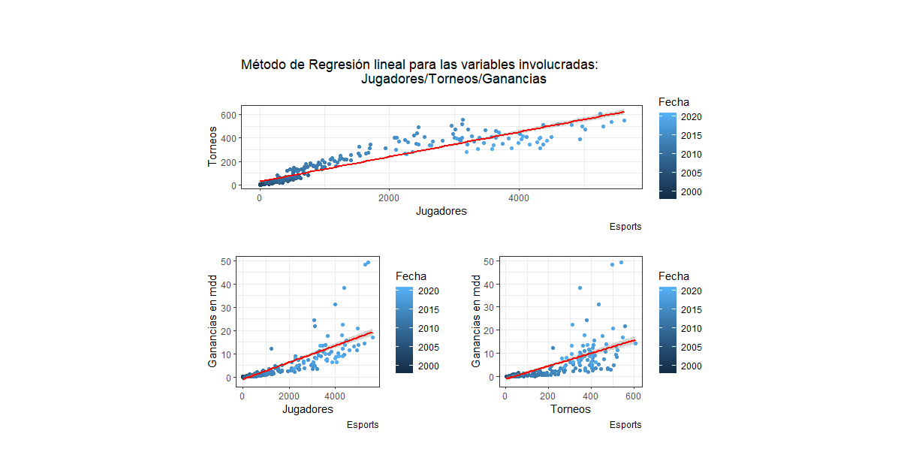

# Datos generales: Hipótesis: ¿Existe una relación entre las variables? ¿Entre cuales?
A partir del análisis realizado hasta el momento, se ha desarrollado una amplia teoría de la evolución de los Esports, a todo esto nos surge la siguiente pregunta, ¿Cuál es la relación entre estás variables: las ganancias, los jugadores y los torneos realizados?

Al visualizar los datos a pares, se puede observar que estos suguieren una tendencia lineal, por lo que se prosigue a realizar dicho ajuste para estudiar está relación.

   
```R
   #Nuevamente creamos un nueva variable donde se agrupa por año las ganancias, jugadores y torneos, esto lo convertimos a un dataframe
  
  df <- join %>%
        group_by(Date) %>%                                              #Agrupamos por año y selecionamos las variables de interés
        summarise(Ganancias = sum(Earnings), 
                  Jugadores = sum(Players), 
                  Torneos = sum(Tournaments))

#Observamos sus características, omitimos valores nulos y ocupamos la función attach() para sólo ocupar los nombres directamente.

summary(df); class(df)
df <- as.data.frame(df)
df <- na.omit(df)
attach(df)
```

Realizamos un ajuste lineal a las variables involucradas y observamos sus características, recodamos que el ajuste se realiza de la forma y~x
```R
m1 <- lm(Torneos ~ Jugadores)                            #Ajuste de Jugadores y Torneos
m2 <- lm(Ganancias ~ Jugadores)                          #Ajuste de Jugadores y Ganancias
m3 <- lm(Ganancias ~ Torneos)                            #Ajuste de Torneos y Ganancias
summary(m1); summary(m2) ; summary(m3)                   #Resumen de las variables
```

<p align="center">

</p>
Cada una presenta un p-value menor a 0.05 y en cada una se tiene un coeficiente de determinanción aceptable para el ajuste.


 
 
 Una vez realizado el ajuste se prosigue a crear una función donde se visualicen el ajuste, la función:
 #### Regresion()
   
 ```R  

regresion <- function(){                                                            #Creamos la función
  
  S1 <- df %>%                                                                      #Se crea una variable para cada gráfica
    ggplot()+
    aes(x=Jugadores,y = Torneos, color = Date)+                                     #Se eliguen las variables y el color de estás a partir de la fecha
    geom_point()+                                                                   #Asignamos que sea una gráfica de puntos  
    geom_smooth(method = "lm", se = T, color = "red")+                              #Dentro de la misma gráfica hacemos el ajuste, con el método "lm", este es el mismo
    labs(title="Método de Regresión lineal para las variables involucradas:         #que se realiza en la parte superior, se agregan demás características
                                Jugadores/Torneos/Ganancias
         ", y="Torneos", 
         x="Jugadores", caption="Esports", colour = "Fecha")+
    theme_bw()
    

  
  "***************************************************************************"
  #Realizamos lo anterior para cada par de variables
  
  
  S2 <- df %>%
    ggplot()+
    aes(x=Jugadores,y = Ganancias/10^6, color = Date)+
    geom_point()+
    geom_smooth(method = "lm", se = T, color = 'red')+
    labs( y="Ganancias en mdd", 
         x="Jugadores", caption="Esports", colour = "Fecha") +
    theme_bw()
  
  
  "***************************************************************************"
  S3 <- df %>%
    ggplot()+
    aes(x=Torneos,y = Ganancias/10^6, color = Date)+
    geom_point()+
    geom_smooth(method = "lm", se = T, color = 'red')+
    labs( y="Ganancias en mdd", 
         x="Torneos", caption="Esports", colour = "Fecha") +
    theme_bw()
 ```
 
 ```R
 #Creamos un panel en el cual visulizamos cada imagen y después visualizamos las mismas
  figure1 <- multi_panel_figure(columns = 2, rows = 2, panel_label_type = "none")
  
  figure1
  
  figure1 %<>%
    fill_panel(S1, column = 1:2, row = 1) %<>%                          #Asignamos a la primera gráfica la parte superior ya que es la que presenta un mayor ajuste
    fill_panel(S2, column = 1, row = 2) %<>%
    fill_panel(S3, column = 2, row = 2)
  figure1
  
}
regresion()                                                          #Al mandar a llamar a la función, se presenta el gráfico
```


Observamos que cada una de estás variables siguen una tendencia lineal, unas en mayor medida que otras
<p align="center">

</p>


Finalmente hacemos un diagnóstico de las regresiones lineales realizadas para saber si cumplen con nuestra hipótesis


<p align="center">

</p>
<p align="center">

</p>
<p align="center">

</p>
