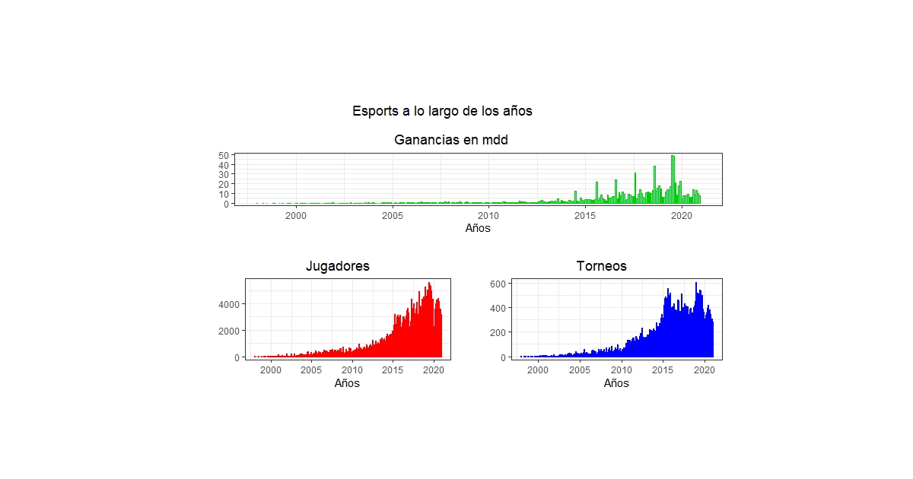

# Datos generales: ¿Cómo han crecido los jugadores, torneos y ganancias generadas a lo largo de los años?
los esports cuentan con un ecosistema sustentable por le que su existencia se mantendrá incluso en crecimiento


### FuncionTotal()

   
   Una vez almacenadas las tres gráfica en distintas variables, creamos un panel con la función  multi_panel_figure() que nos sirvirá para visualizar las tres gráficas en una sola imagen
   
   ```R 

  figure1 <- multi_panel_figure(columns = 2, rows = 2, panel_label_type = "none")       #Creamos la variable del panel y le asignamos sus características 
  
  figure1                                                                               #Visualizamos el panel previamente
  
  figure1 %<>%
    fill_panel(S1, column = 1:2, row = 1) %<>%                                          #Le asignamos las variables con los gráficos y la posición en la que se encontrarán
    fill_panel(S2, column = 1, row = 2) %<>%
    fill_panel(S3, column = 2, row = 2)
  figure1
}

FuncionTotal('123','234','236')                                                          #Llamamos a la función donde se visualizará nuestro gráfica
```

### Resultados 

<p align="center">

</p>
 esto más adelante.
