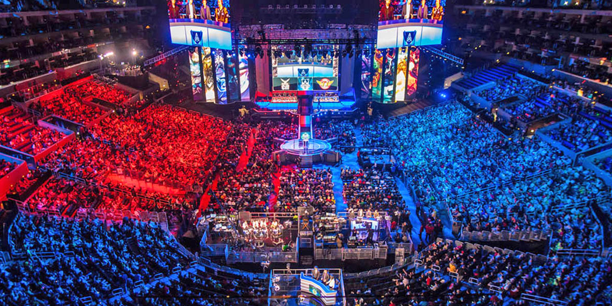

#### Esports

Los esports existen desde hace tiempo, pero es en la actualidad cuando están viviendo su mejor momento en términos de notoriedad, inversión y seguidores, gracias también a la expansión de internet y las nuevas tecnologías y plataformas. Lo que en un principio eran torneos minoritarios o locales, en los últimos tiempos se ha convertido en un fenómeno en el que no solo los jugadores profesionales están implicados, sino también los millones de fans de los videojuegos y la competición que lo siguen desde sus casas o llenan estadios de todo el mundo, desde Seúl hasta Berlín, pasando por Nueva York o Madrid.

### Contenido
 - [Datasets: ¿Con qué información sobre Esports contamos?](Proyecto1/) 
 - [Datos generales: ¡Cómo han crecido los jugadores, torneos y ganancias generadas a lo largo de los años?](Proyecto2/) 
 - [Géneros: ¿Qué juegos han dado mejores premios?¿Que juegos han tenido más torneos?](Proyecto3/) 
 - [Streaming: Juegos con más seguidores y su promedio de visitas.](Proyecto4/)
 - [Jugadores y equipos: ¿Cuáles ganan más?](Proyecto5/) 
 - [Países: ¿Quién ha ganado más torneos?](Proyecto6/) 
 - [Hipótesis: ¿Existe una relación entre las variables?](Proyecto7/)
 - [Predición: El futuro de los Esports](Proyecto8/) 

